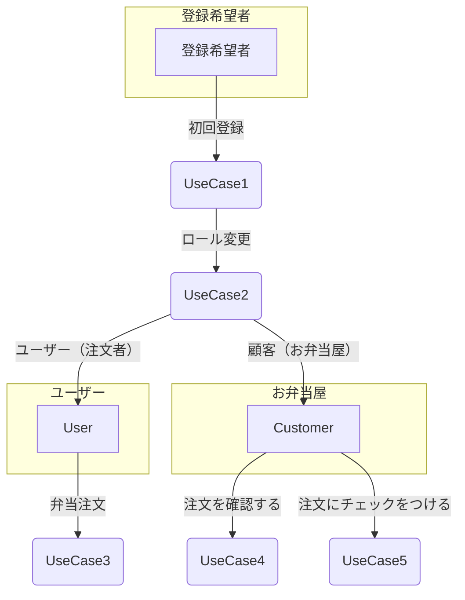
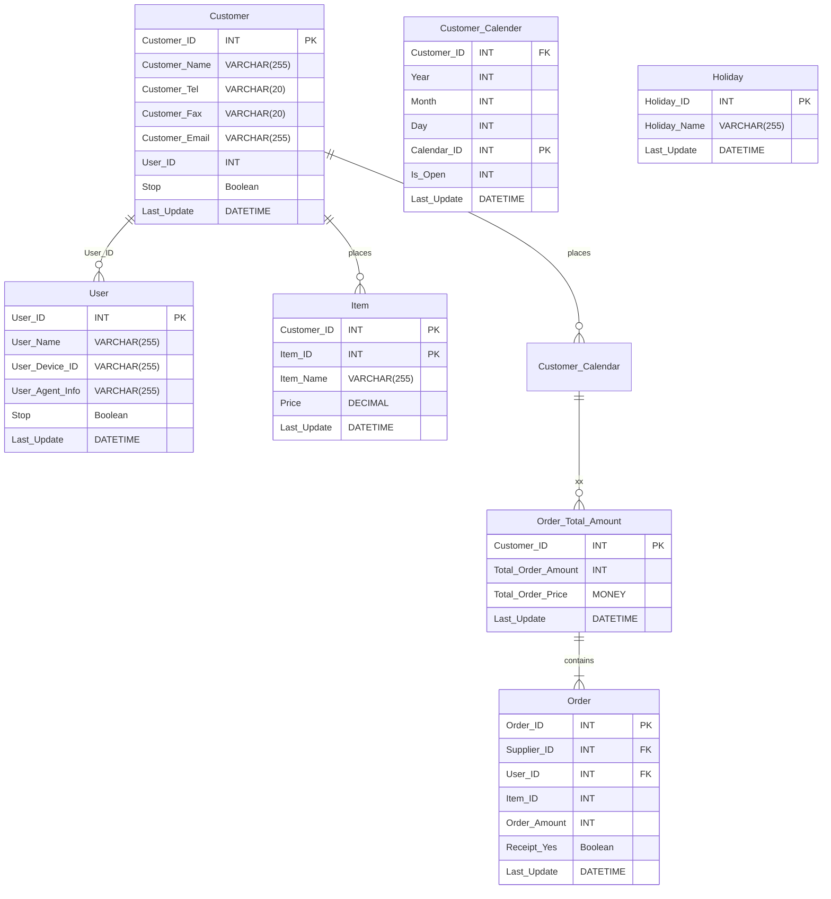
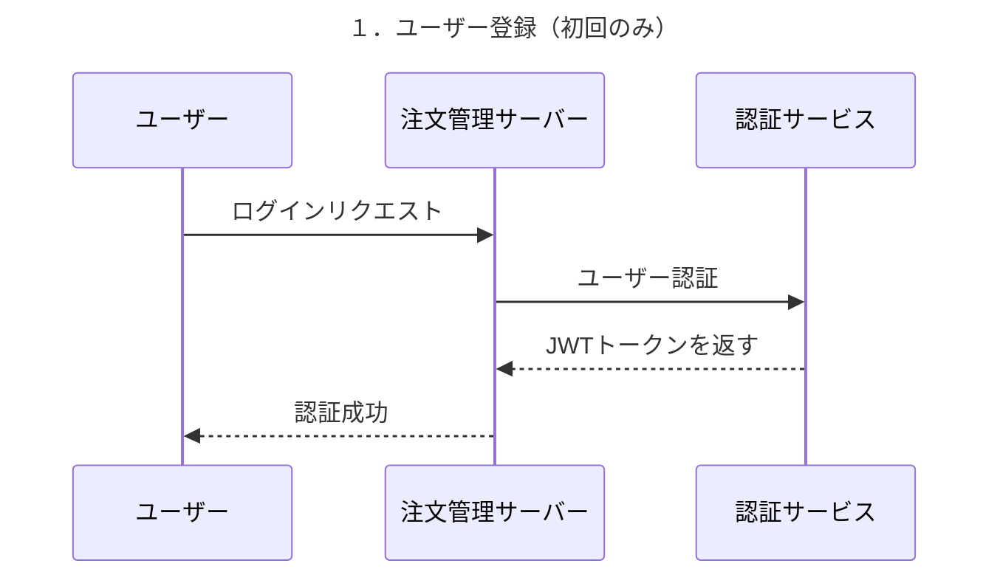
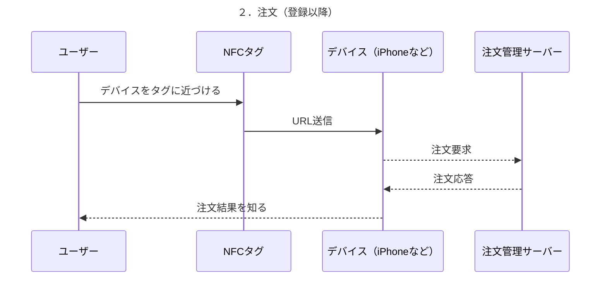
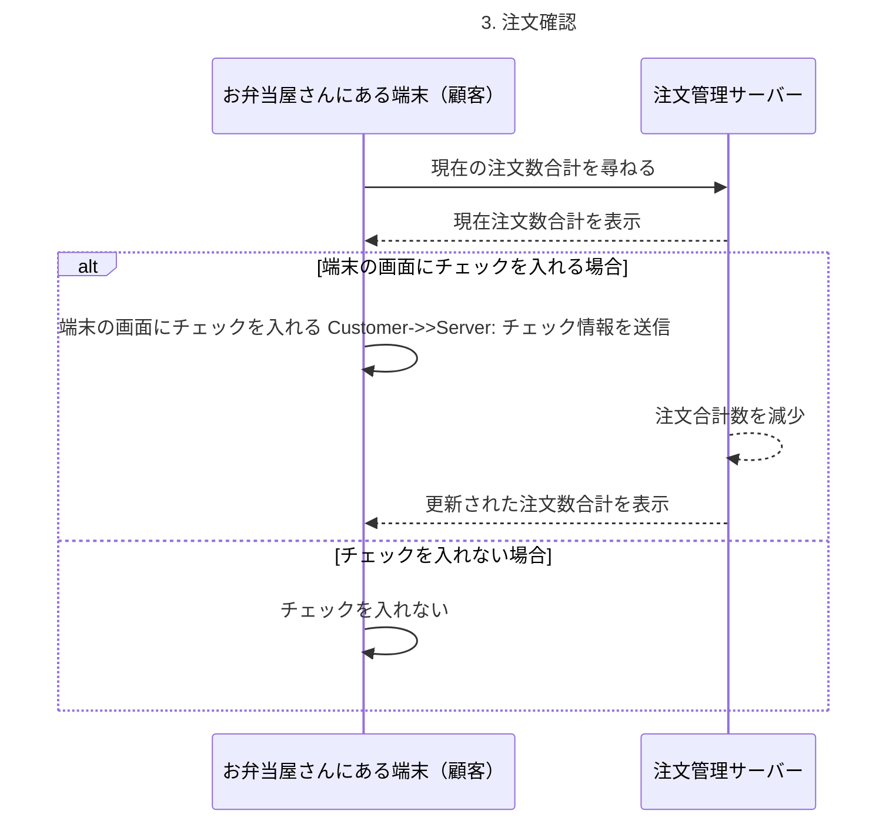
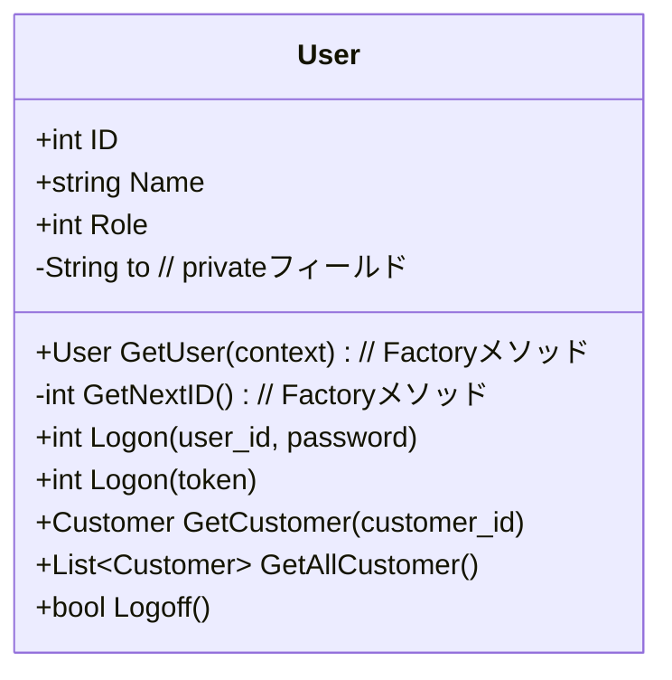

# お弁当注文システム開発プロジェクト 初期型

## 0. 概要 
- **作成日**: 2024-12-20 
- **作成者**: 大隈　慶
- **バージョン**: 1.0 

## 1. 目的 
<details><summary>概要</summary>

- テンシステム社内におけるお昼のお弁当注文を自動化することを目的とする。将来的にはロボットから注文することを可能にする。

- このプロジェクトの目的は、以下の問題を解決するためのシステムを提供することです。 
    - 現在の人力による注文の手間の省力化
    - FAX注文の完全自動化・処理の確実化
</details>

<details><summary>現状把握</summary>

### 1.2 現状把握 
- 現在は職業訓練員が利用者より翌日の注文を承った後、注文用紙に手書きで数量と合計金額を集計して記入、その後FAXで弁当屋宛に送信している。翌日昼前頃に前日の注文の弁当が届けられる。
- 注文書では、以下の項目をFAXで送信している。
    1. ご注文日
    2. お届け日
    3. 施設名
    4. ご担当
    5. 日替わり弁当の個数
    6. 合計金額
- 品目は日替弁当の1種類のみ。
- 注文は職業訓練指導員である脇坂さんに、昼休み終わり１３時前に連絡する。もしくは聞いてくるのに答えて予約とする。
- 注文の締切は前日の14時まで。
- 注文は翌日の注文しかできない。
- 注文キャンセルは13時半まで電話すること。
- 注文キャンセルの際は、キャンセル料として300円を後日徴収する。
- 注文可能曜日は、毎週月・火・水の3日に限られる。
- 金・土 はカレンダーにメニューは載っているが販売していない。
- 木曜は弁当が無指定のため、注文ができない。
- 休日を挟んだ場合は、休日翌日の発注しかできない。
    - 例　翌日水曜が休日の場合は、火曜日注文で木曜配達になる。
~~- 領収書の発行は電話で弁当会社に連絡する、もしくはFAX注文と同時に領収書が必要な宛名を書いて送信する。その後、配達員が弁当配達時に持参して個人に渡す。~~

| 曜日 | 日 | 月 | 火 | 水 | 木 | 金 | 土 |
|-------|-------|-------|-------|-------|-------|-------|-------|
| menu | ✕ | 〇 | 〇 | 〇 | ✕ | 〇 | 〇 |
| 注文 | ✕ | １ | ２ | ３ | ✕ | ✕ | ✕ |
| 配達 | ✕ | ３ | １ | ２ | ✕ | ✕ | ✕ |

</details>

<details><summary>現段階の構想</summary>

### 1.3 現段階の構想
- 利用者が自身のスマホのNFC機能を用いて注文をする。
- 注文はNFCタグで入力後、注文管理サーバで記録する。
- NFCのうち、”NFCタグとの連携機能（パッシブ方式）”を用いて注文を処理する。
- 利用イメージとして、利用者が個人のスマホをNFCタグにかざすことで、NFCタグ内のメモリに記録された URLおよびアクション情報を利用者のスマホが読み取り、自動的に注文管理サーバ（仮）に注文を送信する。
- NFCタグは2種類のタグを用意する。
    - 注文タグ
        - 日替わり弁当の注文合計件数を１件追加する
    - キャンセルタグ
        - 注文合計件数から１件削除する。
- NFCタグ使用による注文の成功・失敗の結果は、それぞれ利用者のWeb画面で確認することができる。
- 注文結果は注文者のスマホのWebブラウザに以下のように表示する
    - 注文に成功した場合
        - 成功の旨の文面を表示する
        - 「あなたの注文を承りました」「〇月✕日　日替弁当 450円 1件」
    - 注文に失敗した場合
        - 失敗の旨の文面を表示する。
        - 「注文に失敗しました。もう一度注文を実行して下さい」
- 注文管理サーバの注文情報は、受注者側に配置してあるタブレット端末に表示する注文管理画面を確認することで現在の注文状況を確認することができる。
~~- スマホからの同時接続数は３件とする。~~
- 将来NFCタグ は用途の変更を可能とする。
    - 例 注文タグを１種類でなく、利用者人数分用意するなど。
</details>

<details><summary>現段階の問題点・議題</summary>

#### 1.4 現段階の問題点・議題
~~1. 注文者特定機能の実装~~
~~- 注文者氏名と注文者ID（もしくはスマホのID）情報を保持する必要があるか。NFCを読んだのち、注文者のスマホのIDを注文先へ送信することをやるか否か。~~
~~2. 領収書の発行機能の自動化~~
~~- 領収書の宛名書き方法のうち、以下の選択肢があるが、そのうち1,2 は宛名情報を発注先に送信するので機能追加が必要となる。~~
   ~~ 1. スマホの固有IDなど利用者情報を宛名に変換するテーブルを用意する~~
    ~~2. 毎回、宛名を入力してもらう~~
    ~~3. もしくは押印済み領収書だけ持参してもらい、発注先が現地で手書きする~~
    ~~4. 別途宛名を電話連絡する。宛名記名済みを持ってきてもらう。~~
3. データ保存先の選択 
~~- データベースを用いることも可能だが、データが少量であればCSVファイルに保存することも可能である。~~
~~例 今月ならば 202412.csvファイルにカレンダーを事前につくり、件数を追記していく。~~
4. ユーザー認証方法
- ユーザー特定のためとメンテナンスのため、ログイン認証を用いる。
- もし社外で既存システムに組み込んで使うならば、統合認証を使う必要があるか？外販したシステム（ロボット）の認証方法はどうするのか？
</details>

<details><summary>将来構想</summary>

### 1.5 将来構想
- 注文者個人を特定して注文を可能にする
    - 領収書の発行を自動化する前準備
- 細かい注文要求に対応する
    - 複数の弁当種別やパン・飲み物など弁当以外の発注にも対応する。
- 既存のシステムとの統合
    - 現在使用中の他システムとの統合利用・連携を可能とする。
    - 共通のポータルより注文操作が可能となる。
- ロボットに注文機能を搭載する
    - 利用者がロボットと対話的に注文をする。
    1. （モニタ画面から注文する）
        - ＮＦＣタグでの発注に代わり、画面操作で注文をすることができる。
    2. （会話で注文する）
        - 利用者の会話の音声入力より、日替わり弁当の注文に該当する部分を自動的に抜き出し、注文APIを呼び出して数量・品目など注文に必要な要素を自動入力後、注文完了まで実行する。 
</details>

## 2. 要件定義 

<details><summary>概要</summary>
</details>

<details><summary>機能要件</summary>

### 2.1 機能要件 
- 注文管理サーバで以下の機能を実装する。
1. **ユーザー登録機能**:（今回省略）
    - 利用者・顧客の初期登録する
    - **入力**: -
    - **出力**: -
2. **メニュー登録機能**:（今回省略）
    - 顧客（弁当会社）のメニューを登録・編集する
    - **入力**: -
    - **出力**: -
3. **注文受信機能**:
    - 利用者のスマホから注文を受信する 
    - **入力**:
    -  (注文追加の場合) タイムスタンプ, 1 
    -  (注文取消の場合) タイムスタンプ, -1
    - **出力**: 
    - （注文追加成功の場合）追加成功の旨の文面・品目・値段・件数
    - （注文取消成功の場合）取消成功の旨の文面・件数
    - （注文失敗の場合）失敗の旨とリトライを促すの旨の文面
2. **二重注文防止機能**: 一日に同じ注文者が誤って再注文をしないようにするため、二重注文を防止する。
    - **入力**: 注文者を特定するID(登録時のIDと照合する)
    - **出力**: （既に注文済がある場合 二重注文の旨のメッセージ,  注文なしの場合　無表示）
3. **注文カレンダー登録機能**: 弁当屋の注文可能日を登録・表示する
    - **入力**: 
    - 指定月
    - 指定月の注文可能な日はデフォルトでnullと設定する。
    - 日付を個別に注文不可の日は-1で設定する。
    - 登録例 2024-12-1,-1,2024-12-8,-1,2024-12-14,-1,2024-12-15,-1,2024-12-22,-1,
    2024-12-29,-1,2024-12-30,-1,2024-12-31,-1,
    - **出力**: 
    - （登録成功）表示例<br>
    2024-12-1, -1, OK<br>
    2024-12-2, null, OK<br>
    2024-12-3, null, OK<br>
    2024-12-4, null, OK<br>
    2024-12-5, null, OK<br>
    2024-12-6, null, OK<br>
    2024-12-7, null, OK<br>
    2024-12-8, -1, OK<br>
    2024-12-9, null, OK<br>
    2024-12-10, null, OK<br>
    (中略)<br>
    2024-12-28, null, OK<br>
    2024-12-29, -1, OK<br>
    2024-12-30, -1, OK<br>
    2024-12-31, -1, OK<br>
    - （登録失敗）
    2024-12-1, -99, NG<br>
4. **注文カレンダー表示機能**:
    - 弁当屋の注文可能日を判定する
    - **入力**:
        - 指定顧客IDかつ指定月
        - 例 001-2025-1   
    - **出力**: 指定月のカレンダー
        - 例 2024,12,1,'日' ～ 2024,12,31,'火' の日付と日付別の注文件数
        - 昨日は自動的に過去日となり変更不可になる。<br>
        注文のなかった過去日（件数がnull）は件数0に強制的に設定する。
5. **日付変換機能**:
    - タイムスタンプを人間の読める日付書式に変換する
    - **入力**:
        - タイムスタンプ
        - 例 2024-12-17-10:43:00   
    - **出力**: 
        - カレンダー日付
        - 例 2024/12/17(火)の場合は、2024,12,17,'火'をコンマ区切りもしくは日付オブジェクトで出力して、表示部で整形表示する。 
<!--6. **ログ記録機能**:
    - 注文履歴をログファイルに記録する
    - **入力**:
        - (1件注文追加の場合) タイムスタンプ, 1 
        - (1件注文取消の場合) タイムスタンプ, -1 
        - (1件注文失敗の場合) タイムスタンプ, -99
    - **出力**:
        - 日付, 注文件数
-->
</details>

<details><summary>非機能要件</summary>

### 2.2 非機能要件 
1. **パフォーマンス**: 
- プロトタイプなので応答レスポンスで厳密なミリ秒単位のリアルタイム性は要求しない。データを１秒未満で送受信できればよい。NFCアクセス即注文確定まで数秒以内とする。
- しかし注文内容が通信として確実に伝達する必要があるため、応答・返答時の通信内容の保証は必要となる。
~~- 注文サーバの処理能力は、テンシステムの社員が２４人なので、同時接続数 ３人に制限する（これは増やしてもよい）。~~
2. **セキュリティ**: 
- 管理サーバログイン時のみHTTPS通信は必要と考えられる。注文通信の暗号化は不要と考えられる。ただし通常の通信で使用する特定可能な会社情報や個人情報、サーバAPI情報などが洩れてはいけない。
- 利用者特定のためのユーザー認証として、当初はログイン認証（セッションベース認証）もしくはJWT(JSON Web Token)認証を用いる。後日、統合認証方式に改めていく。プロトタイプ版は何も認証しない。
- ログファイルは誰でもダウンロードできる。読み取りは可能だが、変更や削除は基本的に不可である。

3. **信頼性**: 
- メンテナンスは年１回が望ましい。バグ修正や機能追加による終日停止は注文ができないので望まない。午前１０時から１２時までの時間帯の停止は望まない。午後停止が望ましい。二重化は必要ないと考えられる。
~~- バックアップは注文を記録するログを一か月保持する。~~
~~- システムはエラー発生時にエラーログを生成し、管理者に通知する。~~
4. **保守性**: 
- GitHubを使用してコードの変更履歴を管理しやすくすると同時に、バグ修正や機能追加を敏速にプロダクションコードに適用できるようにする。
- 初期型は開発環境と本番環境を兼用する。
- できる限り開発者がわかりやすいフォルダ構成・命名規則を用いるようにする。
- APIはテスト可能なものに設計・実装をする。
- テストの自動化を前提とし、CI/CDパイプラインを工程全般に渡って適用する。
- また、将来ロボットで利用することを想定したAPI粒度で設計・製造をする。
5. **拡張性**
- 他のNFCタグ追加、その他メニュー追加に柔軟対応
</details>

<details><summary>システムアーキテクチャ</summary>

## 2.3 システムアーキテクチャ
システムの全体構成を示します。 

- フロントエンド：    React
- バックエンド：      FastAPI (Python)
- ストレージ：        PostgreSQL
- ホスティング環境    AWS
- ソースコード管理：  GitHub
~~- CI/CDパイプライン構築：  ？？？~~
- プロジェクト管理：  GitHub Issue機能
- 使用言語：         JavaScript(もしくはTypeScript), Python
</details>

## 3. 基本設計 

### 3.1 ロール（ユーザー権限）設計
<details><summary>概要</summary>

### 3.1.1 概要
- 対象者は弁当の注文者・弁当の製造者（顧客）・システム管理者の３者で構成される。
- 初回は注文管理サーバにログオンするため、全員ユーザーとして登録する。
ユーザー
- ポータルページへの初回登録でログオンIDとパスワード・自動ログオン機能の有効化を登録する。
- 何もしなければ、そのまま注文者になる。
- 初回登録後はその情報で自動ログオン機能が設定される。
- 初回登録後はNFCタグを読み取って、ポータルページのURLのGET情報を一部変更した情報で注文管理サーバにアクセスする。
</details>

<details><summary>ユーザー種類</summary>

##### 3.1.2 ユーザー種類
- User 弁当の注文者　注文の追加と削除しかできない
- Customer 顧客　弁当の製造者　
- Administrator システムの管理者
システムメンテナンスをやる人。何でもできる。
</details>

<details><summary>お弁当注文のユースケース</summary>


### 説明 
- `UseCase1`：ユーザー - 初回登録　ユーザー登録をします
- `UseCase2`：ユーザー - ロール変更　ユーザーのロールを変更します
- `UseCase3`：弁当注文　注文をします
- `UseCase4`：注文確認　お弁当屋が注文合計を確認します
- `UseCase5`：注文完了　チェックを入れて注文を完了します
</details>

<details><summary>今回省略するもの</summary>

#### 3.1.4 今回省略するもの
- （管理者が直接データベースのデータをいじって追加するため）
- 注文者・顧客の初期登録
- 注文者・顧客選択操作(ユーザー登録時にログイン者に選択させる)
- 顧客のメニュー登録
</details>


### 3.2 データベース設計 
<details><summary>概要</summary>

#### 3.2.1 概要
- データベースはPostgreSQLを用いる。
~~- 永続ストレージとしてデータベースを用いることも可能だが、データが少量であればCSVファイルに保存することも可能である。~~
- テーブル数：7（うちマスタ：4、トランザクション：3）
- マスタテーブル
    - User ユーザー（お弁当の注文者）
    - Customer 顧客(弁当会社)
    - Item 商品
    - Holiday 共通休日テーブル
- トランザクションテーブル
    - Customer_Calender 顧客(弁当会社)カレンダー
    - Order 注文
    - Order_Total_Amount 注文合計
    ~~- Log ログ~~
</details>

<details><summary>ER図</summary>


</details>

<details><summary>テーブル定義</summary>

### 3.2.2 テーブル定義

<details><summary>概要</summary>
未作成
</details>

<details><summary>User ユーザー</summary>

**User ユーザー**
- 注文管理サーバの全利用者・登録者
- 初回に全員設定する
- Customerも同じユーザーIDになる
- Customer以外は弁当の注文者になる

| カラム名         | データ型      | 説明             | キー  | Null許容 | 例  |
|------------------|---------------|------------------|------|----------|----------------|
| User_ID          | INT           | ユーザーID       | PK   | No       | 00011（自動連番あり） |
| User_Name        | VARCHAR(255)  | ユーザー名       | -    | No       | 大隈 慶 |
| User_Device_ID   | VARCHAR(255)  | 端末固有ID       | -    | Yes      | ~~4564681521~~ |
| User_Agent_Info  | VARCHAR(255)  | 端末Agent情報    | -    | Yes      | ~~4564681521~~ |
| Is_Customer      | Boolean       | 顧客機能許可     | -    | No       | （注文者機能のみ付与: False, 顧客機能を付与: Yes）(default: False) |
| Stop             | Boolean       | 使用停止         | -    | Yes      | （使用不可: True, 使用可能: null or False）(default: True) |
| Last_Update      | DATETIME      | 最終更新日       | -    | No       | 2025-1-6-09:05:00 |
</details>

<details><summary>Customer 顧客</summary>

**Customer 顧客**
- 顧客（弁当会社）
- ユーザーが選択して属性を変更する

| カラム名         | データ型      | 説明             | キー  | Null許容 | 例  |
|------------------|---------------|------------------|------|----------|----------------|
| Customer_ID      | INT           | 顧客ID           | PK   | No       | 001（自動連番あり） |
| Customer_Name    | VARCHAR(255)  | 顧客名           | -    | No       | はーとあーす勝谷 |
| Customer_Tel     | VARCHAR(255)  | 電話番号         | -    | Yes      | 083-263-0150 |
| Customer_Fax     | VARCHAR(255)  | Fax番号          | -    | Yes      | 083-263-0151 |
| Customer_Email   | VARCHAR(255)  | Email            | -    | Yes      | info@heart-earth.co.jp |
| User_ID          | INT           | ユーザーID       | FK: User.User_ID   | No       | 00011（自動連番あり） |
| Stop             | Boolean       | 使用不可         | -    | Yes      | （使用不可: True, 使用可能: null or False）(default: True) |
| Last_Update      | DATETIME      | 最終更新日       | -    | No | 2025-1-6-09:05:00 |
</details>

<details><summary>Item 商品</summary>

**Item 商品** 
- 顧客（弁当会社）の商品
- Customer_ID と Item_ID　の複合キー

| カラム名         | データ型      | 説明             | キー  | Null許容 | 例  |
|------------------|---------------|------------------|------|----------|----------------|
| Customer_ID      | INT           | 弁当会社ID       | PK Customor:Customer_ID   | No       | 001（自動連番あり） |
| Item_ID          | INT           | 商品ID           | PK   | No       | 01（自動連番あり） |
| Name             | VARCHAR(255)  | 商品名           | -    | No       | 日替わり弁当 |
| Price            | MONEY         | 金額             | -    | No       | 450 |
| Last_Update      | DATETIME      | 最終更新日       | -    | No | 2025-1-6-09:05:00 |
</details>

<details><summary>Order 注文</summary>

**Order 注文** 
- 注文者の顧客（弁当会社）への注文
| カラム名         | データ型      | 説明             | キー         | Null許容 | 例  |
|------------------|---------------|------------------|-------------|----------|----------------|
| Order_ID         | INT           | 注文ID           | PK          | No       | 00001（自動連番あり） |
| Supplier_ID      | INT           | 弁当会社ID       | FK          | No       | 001 |
| User_ID          | INT           | ユーザーID       | FK          | No       | 00011（自動連番あり） |
| Item_ID          | INT           | 商品ID           | -           | No       | 01 |
| Order_Amount     | INT           | 注文件数         | -           | No       | 1 |
| Order_Price      | MONEY         | 注文金額         | -           | No       | 1250 |
| Receipt_Yes      | BOOLEAN       | 請求書有無       | -           | Yes      | （不要: null or False, 必要: True）(default: null) |
| Last_Update      | DATETIME      | 最終更新日       | -           | No       | 2025-1-6-09:05:00 |

</details>

<details><summary>Customer_Calender 顧客（弁当会社）カレンダー</summary>

**Customer_Calender 顧客（弁当会社）カレンダー** 
- 顧客（弁当会社）の営業日カレンダー

| カラム名         | データ型      | 説明             | キー         | Null許容 | 例  |
|------------------|---------------|------------------|-------------|----------|------------------------|
| Customer_ID      | INT           | 弁当会社（顧客）ID| FK: Customer | No      | 001 (1000:弊社, 000:法定休日, 001-999: 顧客) |
| Year             | INT           | 年               | -           | No       | 2025 |
| Month            | INT           | 月               | -           | No       | 1 |
| Day              | INT           | 日               | -           | No       | 6 |
| Calendar_ID      | INT           | 弁当会社カレンダーID | PK        | No       | 弁当会社ID+年+月+日 20250106 |
| Is_Open          | INT           | 営業日           | null         | Yes      | （開業: 0 or null, 休業: -1）(default: null) |
| Last_Update      | DATETIME      | 最終更新日       | -            | No | 2025-1-6-09:05:00 |
</details>

<details><summary>Order_Total_Amount 注文合計</summary>

**Order_Total_Amount 注文合計** 
- 顧客（弁当会社）の注文実績

| カラム名            | データ型 | 説明 | キー  | Null許容 | 例  |
|---------------------|---------------|------------------|------|----------|-----------------|
| Calendar_ID         | INT           | カレンダーID     | PK Customer_Calender.Calendar_ID  | No       | 20250106 |
| Total_Order_Count   | INT           | 合計注文件数     | -    | No       | 4 |
| Total_Order_Price   | MONEY         | 合計注文金額     | -    | No       | 1800 |
| Last_Update         | DATETIME      | 最終更新日       | -    | No | 2025-1-6-09:05:00 |
</details>

<details><summary>Holiday 共通休日テーブル</summary>

**Holiday 共通休日テーブル** 
- 弊社・顧客および法定休日を表す

| カラム名            | データ型 | 説明 | キー  | Null許容 | 例  |
|---------------------|---------------|------------------|------|----------|-----------------|
| Holiday_ID          | INT           | 休日ID           | PK   | No | 000 |
| Holiday_Name        | VARCHAR(255)  | 休日名           | -    | No | 元旦 |
| Last_Update         | DATETIME      | 最終更新日       | -    | No | 2025-1-6-09:05:00 |
</details>

</details>

### 3.3 シーケンス図

<details><summary>概要</summary>
</details>

<details><summary>ユーザー登録</summary>

#### 3.3.1 （初回のみ）ユーザー登録

</details>

<details><summary>注文</summary>

#### 3.3.2 （登録以降）お弁当の注文

</details>

<details><summary>注文確認</summary>

#### 3.3.3 お弁当屋が注文を確認する

</details>

<details><summary>注意</summary>

- 注意: シーケンス図の表示には、VisualStudioCodeにmarmaidプラグイン（Markdown Preview Mermaid Support）のインストールが必要。
</details>


### 3.4 クラス設計 

<details><summary>概要</summary>

#### 3.4.1 概要
- 各クラスの詳細を記載します。
</details>

<details><summary>User ユーザー</summary>

#### 3.4.2 User ユーザー

- アクセスする
1. **ユーザーオブジェクトの取得**:
    ```javascript
    // Factoryメソッドを使ってユーザーオブジェクトを生成
    const User = User.GetUser(this);
    ```


### 説明
- `+User GetUserRoll() `：プライベートメソッドとして定義されたフィールド変数。 
- `+List~int~ GetIDs`：パブリック変数として定義されたフィールド変数
- `GetUser(context)`ログオン情報から権限オブジェクトを取得します
- `Logon({ user_id: id, password: password })`IDとパスワードを使ってログオン
- `Logon({ token: token })`トークンを使ってログオンします
- `GetCustomer()`IDで指定した顧客を取得します
- `GetAllCustomer()`ユーザー権限範囲内の全顧客を取得します
- `Logoff()`ログオフします
</details>


## 4. 詳細設計 

### 4.1 サーバ設計

<details><summary>サーバ設計</summary>

#### 4.1.1 概要
- ホスティングするサーバの詳細を記載します。

#### 4.1.2 API記述例
##### 例 
- お弁当の注文者(User:003)が、お弁当会社(Customer:001)宛てに、日替わり弁当(１種類のみ)を注文する場合
- お弁当を1品追加 
    - https://example.com/api/user?id=003&customer_id=001&bento=1
- お弁当を1品削除
    - https://example.com/api/user?id=003&customer_id=001&bento=-1 
- 現在の注文を表示
    - https://example.com/api/user?id=001&customer_id=001&total=1 

</details>

### 4.2 インターフェース設計 
<details><summary>インターフェース設計</summary>

### 4.2.1 概要
 <details><summary>概要</summary>

- 各インターフェースの詳細を記載します。
</details>

### 4.2.1 ユーザー認証操作
 <details><summary>ユーザー認証共通</summary>

#### ログオン認証
1. **ユーザーオブジェクトの取得**:
    ```javascript
    // Factoryメソッドを使ってユーザーオブジェクトを生成
    const User = User.GetUser(this);
    ```

2. **ユーザーログオン（IDとパスワード使用）**:
    ```javascript
    const hasPermission = User.Logon(
        { id: user_id, password: password });
    ```

3. **ユーザーログオン（トークン使用）**:
    ```javascript
    const hasPermission = User.Logon({ token: token });
    ```

4. **ユーザーが顧客かどうかの確認**:
    ```javascript
    const isCustomer = User.IsCustomer();
    ```

5. **特定の顧客情報の取得（顧客ID指定）**:
    ```javascript
    const Customer = User.GetCustomer({ customer_id: 001 });
    ```

6. **ユーザーの全顧客情報の取得**:
    ```javascript
    const Array<Customer> = User.GetAllCustomer();
    ```

#### ログオフ
7. **ユーザーログオフ**:
    ```javascript
    const isSucceeded = User.Logoff();
    ```

### 説明
- **User.GetUser(this)**: ユーザーオブジェクトを取得するファクトリーメソッド。
- **User.Logon**: ユーザーのログオンを行うメソッド。IDとパスワード、またはトークンを使用します。
- **User.IsCustomer**: ユーザーが顧客であるかを確認するメソッド。
- **User.GetCustomer**: 顧客情報を取得するメソッド。特定の顧客IDを指定するか、現在のユーザーの顧客情報を取得します。
- **User.Logoff**: ユーザーのログオフを行うメソッド。

 </details>

### 4.2.2 通常操作
 <details><summary>注文</summary>

#### 注文

1. **注文数の取得**:
    ```javascript
    const myOrderCount = User.GetOrderCount();
    ```

2. **全注文の取得**:
    ```javascript
    const myOrders = User.GetOrders();
    ```

3. **メニューの取得**:
    ```javascript
    const Menu = Customer.GetMenu();
    ```

4. **新しい注文の作成**:
    ```javascript
    const myOrder = Orders.Create(
        { item_id: Menu[0], amount: 1 });
    ```

5. **新しい注文を既存の注文リストに追加**:
    ```javascript
    const NewOrders = myOrders.Add(Order);
    ```

6. **注文の削除**:
    ```javascript
    const isRemoved = NewOrders.Remove(Orders[0]);
    ```

7. **注文の保存**:
    ```javascript
    const isSuccessed = NewOrders.Save();
    ```

8. **重複入力チェックの実行（private）**:
    ```javascript
    private const isOK = myOrders.CheckDouble(Order);
    // 二重チェック
    ```

9. **注文の締日を確認**:
    ```javascript
    const due_date = myOrder.CheckDueDate(Order);
    ```
 </details>

 <details><summary>商品管理</summary>

#### 4.2.3 商品管理

1. **商品数の取得**:
    ```javascript
    const ItemCount = Customer.GetItemCount();
    ```

2. **全商品の取得**:
    ```javascript
    const Items = Customer.GetAllItems();
    ```

3. **新しい商品の作成**:
    ```javascript
    const NewItem = Item.Create(
        { item_name: "DX日替わり弁当", price: 600 });
    ```

4. **既存商品の修正**:
    ```javascript
    const ModifyItem = Item.Modify(
        { item_id: 001, item_name: "日替わり弁当", price: 451 });
    ```

5. **商品停止状態の確認**:
    ```javascript
    const isStopped = Item.IsStop();
    ```

6. **商品を停止する**:
    ```javascript
    const isSuccessed = Item.Stop();
    ```

7. **商品を再開する**:
    ```javascript
    const isSuccessed = Item.Restart();
    ```

8. **特定の商品の取得**:
    ```javascript
    const Item = Items.GetItem({ item_id: 001 });
    ```

9. **新しい商品を商品リストに追加**:
    ```javascript
    const Items = Items.Add(NewItem);
    ```

10. **商品の保存**:
    ```javascript
    const isSuccessed = Items.Save();
    ```

11. **商品のチェック（private）**:
    ```javascript
    private const isOK = Items.Check(Item);
    ```
 </details>

 <details><summary>注文管理</summary>

#### 4.2.4 注文管理

1. **注文数の取得**:
    ```javascript
    const OrderCount = Customer.GetOrderCount();
    ```

2. **全注文の取得**:
    ```javascript
    const Orders = Customer.GetAllOrders();
    ```

3. **特定の日の注文を取得**:
    ```javascript
    const Orders = Customer.GetOrders(
        { year: 2025, month: 1, day: 6 });
    ```

4. **特定の月の注文を取得**:
    ```javascript
    const Orders = Customer.GetOrders(
        { year: 2025, month: 1 });
    ```

5. **特定の注文の取得（注文ID指定）**:
    ```javascript
    const Order = Customer.GetOrder(
        { order_id: 00001 });
    ```

6. **特定の日の注文を取得（年月日指定）**:
    ```javascript
    const Order = Customer.GetOrder(
        { year: 2025, month: 1, day: 6 });
    ```

7. **新しい注文の作成**:
    ```javascript
    const Order = Order.Create(
        { item_id: 001, amount: 1, from: user_id });
    ```

8. **注文リストに注文を追加**:
    ```javascript
    const Orders = Orders.Add(
        { item_id: 001, order_id: 001, amount: 1 });
    ```

9. **注文の修正**:
    ```javascript
    const Order = Order.Modify(
        { order_id: 001, item_id: 001, amount: 1 });
    ```

10. **注文の削除**:
    ```javascript
    const isSuccess = Customer.Remove(
        { order_id: 001, item_id: 001, amount: 1 });
    ```
 </details>

 <details><summary>顧客カレンダー管理</summary>

#### 4.2.5 顧客カレンダー管理

1. **カレンダーの取得**:
    ```javascript
    const Calendar = Customer.GetCalendar(
        { year: 2025, month: 1 });
    ```

2. **新しいカレンダーの作成**:
    ```javascript
    const isSuccess = Calendar.Create(
        { year: 2025, month: 1, day: 1 });
    ```

3. **カレンダーの修正**:
    ```javascript
    const isSuccess = Calendar.Modify(
        { year: 2025, month: 1, day: 9, Open_day: -1 });
    ```

4. **カレンダーの削除**:
    ```javascript
    const isSuccess = Calendar.Delete(
        { year: 2025 });
    ```
 </details>

### 4.2.3 管理者操作

 <details><summary>顧客管理</summary>

##### 4.2.3.1 顧客管理

1. **全顧客の取得**:
    ```javascript
    const AllCustomers = Administrator.GetAllCustomers();
    ```

2. **特定の顧客の取得**:
    ```javascript
    const myCustomer = Administrator.GetCustomer(
        { customer_id: 001 });
    ```

3. **新しい顧客の作成**:
    ```javascript
    const newCustomer = Administrator.CreateCustomer(
        { customer_id: 002, customer_name: "はーとあーす勝谷2" });
    ```

4. **顧客情報の修正**:
    ```javascript
    const Customer = Administrator.ModifyCustomer(
        { customer_id: 002, customer_name: "はーとあーす勝谷二号線" });
    ```

5. **顧客の削除**:
    ```javascript
    const isDeleted = Administrator.DeleteCustomer(
        { customer_id: 002 });
    ```
 </details>


 <details><summary>商品管理</summary>

##### 4.2.3.2 商品管理

1. **全商品の取得**:
    ```javascript
    const Items = Customer.GetAllItems();
    ```

2. **特定の商品の取得**:
    ```javascript
    const Item = Customer.GetItem({ item_id: 001 });
    ```

3. **商品の修正**:
    ```javascript
    const Item = Item.Modify(
        { item_name: "日替わり弁当", price: 451 });
    ```

4. **新しい商品の作成**:
    ```javascript
    const Item = Item.Create(
        { id: 002, name: "DX日替わり弁当", price: 600 });
    ```

5. **商品の削除**:
    ```javascript
    Boolean isSuccessed = Item.Delete();
    ```
 </details>


 <details><summary>注文管理</summary>

##### 4.2.3.3 注文管理

1. **全注文の取得**:
    ```javascript
    const Orders = Customer.GetAllOrders();
    ```

2. **特定の日の注文を取得**:
    ```javascript
    const Orders = Customer.GetOrders(
        { year: 2025, month: 1, day: 6 });
    ```

3. **特定の注文の取得**:
    ```javascript
    const Order = Customer.GetOrder(
        { order_id: 00001 });
    ```

4. **注文の修正**:
    ```javascript
    Boolean = Order.Modify(
        { item_id: 001, amount: 1 });
    ```

5. **新しい注文の作成**:
    ```javascript
    Boolean = Order.Create(
        { item_id: 001, amount: 1 });
    ```

6. **注文の削除**:
    ```javascript
    Boolean = Order.Delete();
    ```
 </details>

 <details><summary>顧客カレンダー管理</summary>

##### 4.2.3.4 顧客カレンダー管理

1. **カレンダーの取得**:
    ```javascript
    const myCalendar = Customer.GetCalendar(
        { year: 2025, month: 1 });
    ```

2. **新しいカレンダーの作成**:
    ```javascript
    const myCalendar = Customer.CreateCalendar(
        { year: 2025, month: 1 });
    ```

3. **カレンダーの修正**:
    ```javascript
    const isSuccessed = Calendar.Modify(
        { month: 1, day: 7, Open_Day: -1 });
    ```

4. **カレンダーの削除**:
    ```javascript
    const isSuccessed = myCalendar.Delete();
    ```
 </details>


### 4.2.4  ヘルパー関数
 <details><summary>連番生成</summary>

##### 4.2.4.1 連番生成
1. **次のユーザーIDの生成**:
    ```javascript
    const next_integer = Users.NextID(User);
    ```

2. **次の顧客IDの生成**:
    ```javascript
    const next_integer = Customers.NextID();
    ```

3. **次の注文IDの生成**:
    ```javascript
    const next_integer = Orders.NextID();
    ```
 </details>

</details>

### 4.9 備考
<details><summary>NFC処理について注意点</summary>

#### NFC処理について注意点
- iPhone・Android共にNFCリーダーの設定は不要。
- iPhoneの場合、NFC読み取りで毎回確認ダイアログを表示する。Androidはダイアログ非表示。
</details>


## 5. テスト計画 

<details><summary>概要</summary>
テスト概要をここに書きます。
</details>

<details><summary>テストツール</summary>
テストツールについてここに書きます。
</details>

<details><summary>単体テスト</summary>

### 5.3 単体テスト 
- 各機能の単体テストの方法を記載します。 
    1. フロントエンド側のテストフレームワーク：
    2. サーバー側のテストフレームワーク：
</details>

<details><summary>結合テスト</summary>

### 5.4 結合テスト
- システム全体の結合テストの方法を記載します。 
</details>

## 6. リスク管理 
<details><summary>概要</summary>

- プロジェクトに関連するリスクとその対応策を記載します。 
### 6.1 リスク対応
- 基本的に対応可能日は平日のみとする。土日祝日は対応しない。
</details>


## 7. スケジュール 

<details><summary>概要</summary>

- 開発開始日: 2024-12-16 
- 開発終了日: YYYY-MM-DD 
- マイルストーン: マイルストーンの一覧 
1. 要件定義作成完了     2024-12-16
2. 暫定仕様書作成完了   2024-12-20
3. 仕様書レビュー       2024-12-20
4. 暫定仕様書修正完了   2024-12-20
</details>


## 99. 付録
<details><summary>参考資料</summary>

- その他の参考資料や追加情報を記載します。
### 要件定義書ドラフト
https://chatgpt.com/share/675fa125-e804-800b-99cf-6820389efba2
### セキュリティ
[JWT認証の流れを理解する](https://qiita.com/asagohan2301/items/cef8bcb969fef9064a5c)

プロトタイプtestサイト
https://kei-okuma1216.github.io/Obento-Test/

</details>
<br>
以上
